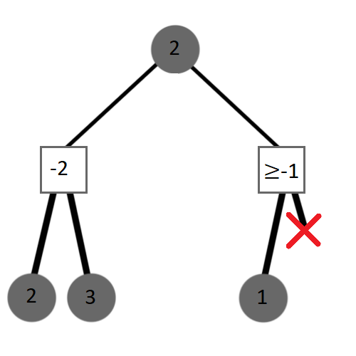
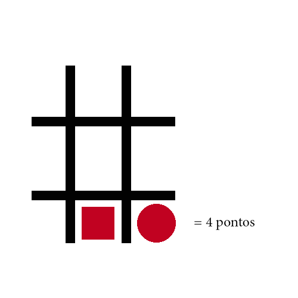
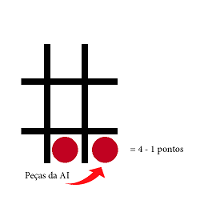
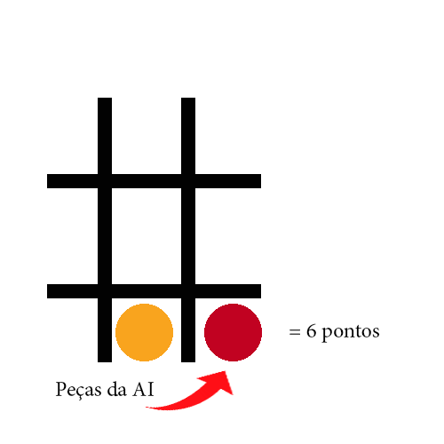

## Projeto realizado por:
- João Matos - 21901219  
- Rodrigo Marques - 21802593

# Arquitetura de solução  

## Controlador de Versões  
- V8 - Removed Threads
- V7 - Added Threads
- V6 - Updated Heuristic 
- V5 - Repository Fixed  
- V4 - Fixed First Move Bug Done  
- V3 - Added Heuristic Done  
- V2 - Working AI   
- V1 - Working AI  
- Configuração - AI Script Setup  
- Projeto Criado - First Commit  

## Negamax  
Para o nosso projeto foi implementado o algoritmo `Negamax` que executa as jogadas sempre na perpetiva do jogador que tem o próximo movimento, onde os resultados são invertidos e maximizados, tendo assim apenas uma condição para alterar o melhor movimento, fazendo assim o `Negamax` mais eficaz que o `Minimax`.  

  

## Heurística  
Para a nossa heurística pensámos em verificar as peças ao redor de cada uma, ou seja, verificando cada peça do tabuleiro. São verificadas as oito possíveis peças que as rodeiam, sendo que por cada peça que seja da mesma cor que a do jogador, é somado um valor para a heurística, valor esse ligeiramente reduzido caso as duas tenham mesma forma, e reduzido a metade caso as duas peças tenham a forma do adversário.  
Se as peças tiverem a mesma forma (do jogador) mas cores diferentes, o valor somado à heuristica é superior, fazendo assim o AI assumir que é uma situação mais valiosa para chegar à vitória.
Sendo que quando é calculada a heuristica, o valor é somado se a peça for do jogador em questão e subtraído se for do adversário.  

  
  
  
  